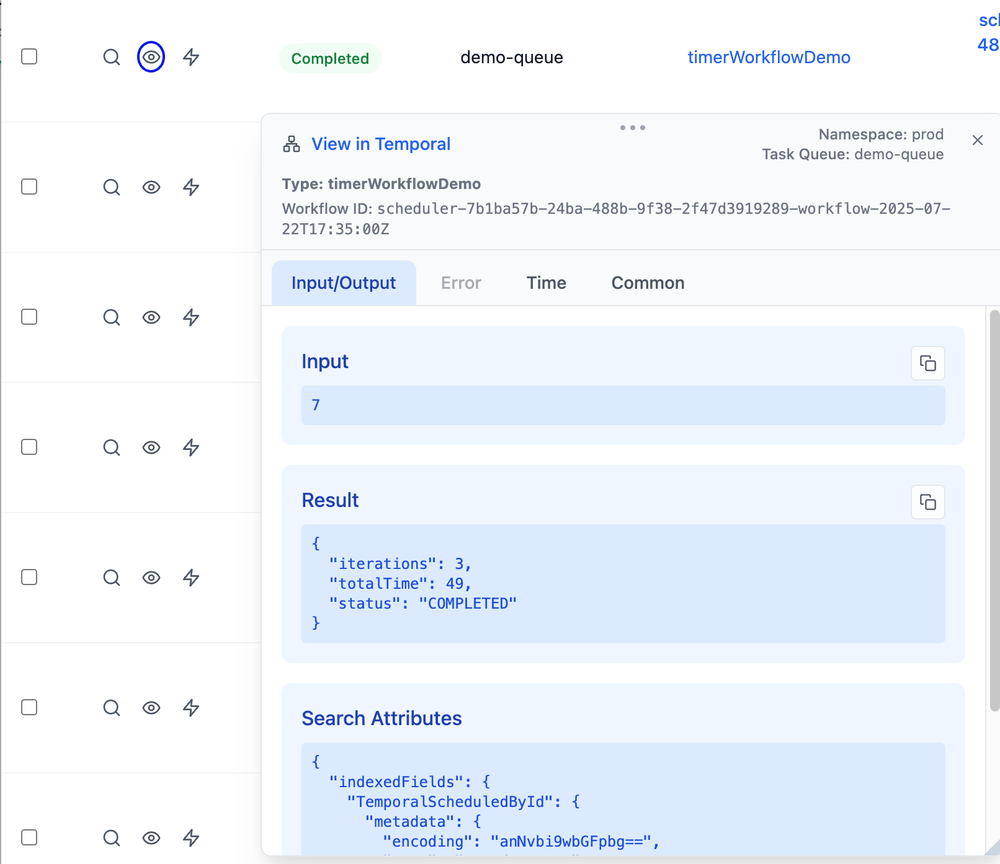
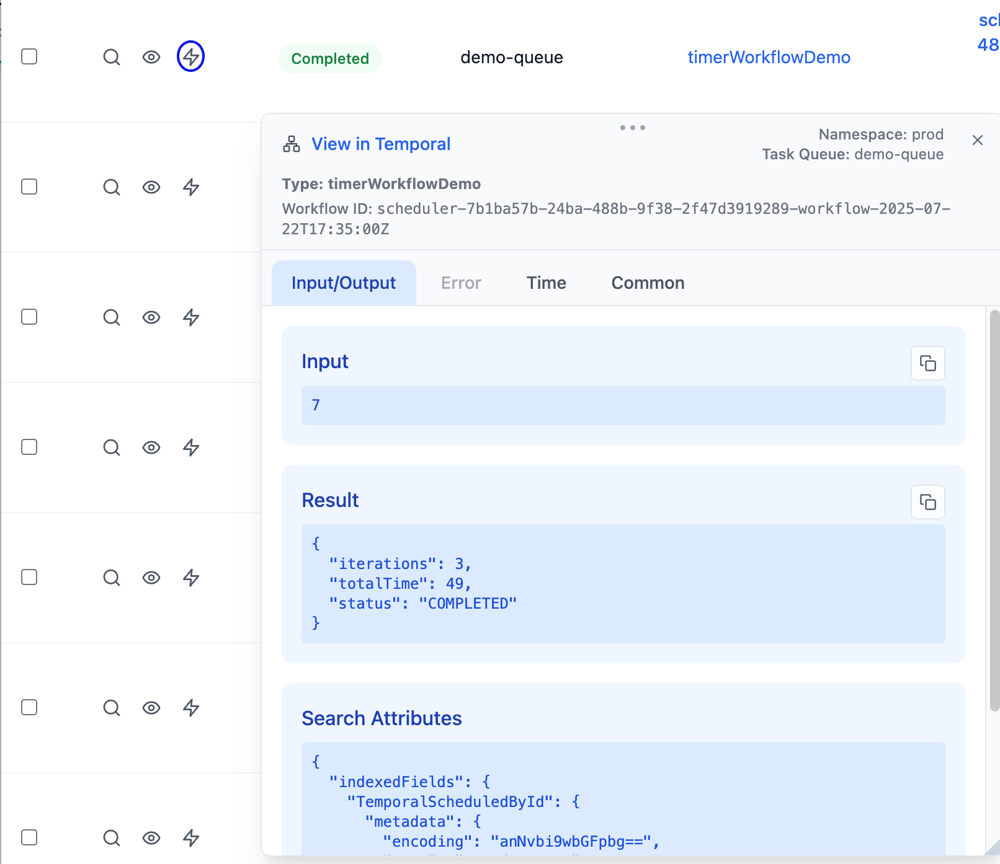
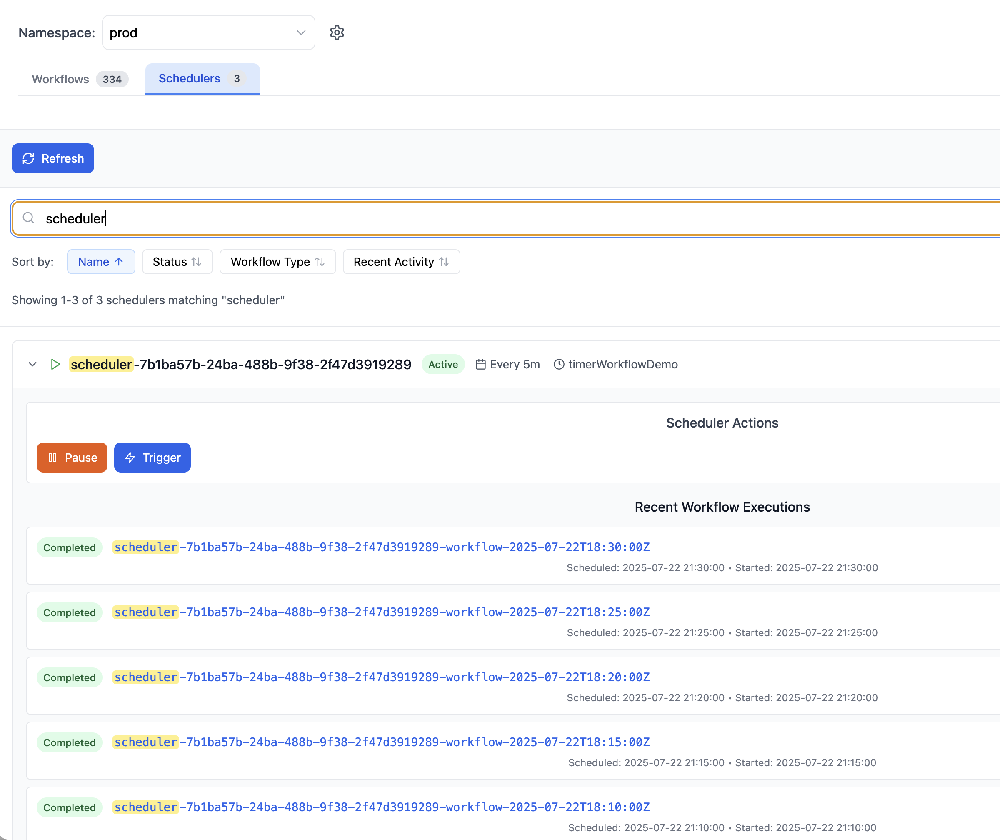
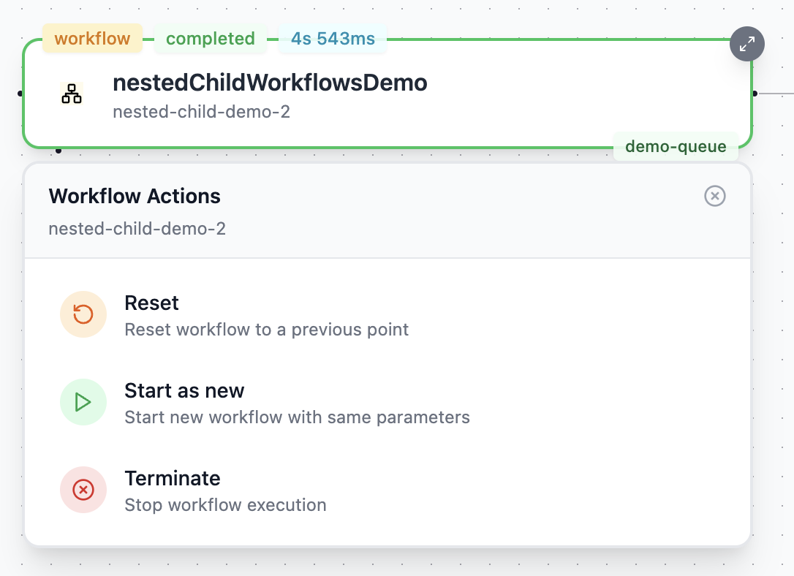

# Temporal Flow

A powerful developer tool for visualizing and debugging Temporal workflows through an interactive graph interface.

[Features](#-features) • [Demo](#-demo) • [Installation](#-installation) • [Usage](#-usage) • [Contributing](#-contributing)

## Overview

Temporal Flow is a developer tool designed to enhance observability and debugging of workflows within [Temporal](https://temporal.io/). It presents workflow executions as an interactive graph, enabling intuitive navigation through nested workflows and providing a faster, smarter search experience compared to the default Temporal Web UI.

## ✨ Features

- 🔐 **Simple Authentication**  
  Connect seamlessly to both Temporal Cloud and self-hosted servers with an easy-to-use authentication interface.

- 🔍 **Advanced Search**  
  Quickly locate workflows, activities, and nested executions with an intuitive search bar supporting partial names, workflow types, and more. Enhanced search capabilities for both workflows and schedulers.

- 🧭 **Interactive Graph Visualization**  
  Visualize relationships between parent and child workflows as an interactive node graph, making it easy to explore deeply nested or complex workflows at a glance.

- 🪄 **Seamless Exploration**  
  Hover and click on graph nodes to inspect workflow details such as execution status, timestamps, and input/output payloads—all without leaving the context of the graph.

- ⚡ **Workflow Operations**  
  Manage workflows directly with actions like terminate, retry, and start as new. Perform batch operations on multiple workflows through the search interface.

- ⏰ **Scheduler Management**  
  Control scheduler operations with pause and trigger functionality, making it easy to manage temporal schedules.

- 📱 **Quick Access Menu**  
  Right-click context menu for fast access to common Workflow operations, plus a convenient CMD + K command palette for quick navigation and actions.

- 🔄 **Live Mode**  
  Follow running workflows in real-time with live updates, perfect for monitoring active executions.

- 🚀 **Performance Optimized**  
  Designed with performance and usability in mind to improve speed and developer experience during workflow analysis.

## 🔑 Quick Authentication Guide
1. Click the `Authenticate` button
2. Choose `Cloud` or `Local server`

1. **Temporal Cloud**
   - Leave the Cloud Namespace as is
   - Authenticate using SSO (Recommended!) or use an API Key
   - Note that if you use an API Key some of the functions might not work because of Temporal permissions.

2. **Self-hosted Temporal**
   - Enter your self hosted Termporal UI address (e.g., `localhost:8080`)
   - Note that if it is hosted on k8s or something similar, you need to use port forward or expose the Temporal UI so the app can access it.

## 🔐 Authentication Process

Temporal Flow provides two authentication methods: Temporal Cloud and Local Server. Here's how each method works under the hood:

### Temporal Cloud Authentication

We offer two ways to authenticate with Temporal Cloud:

1. **Browser-Based SSO (Recommended)**
   - When you click "Authenticate with Temporal Cloud":
   - The app opens your system browser to Temporal Cloud's login page
   - You complete the authentication in your secure browser environment
   - After successful login, our app detects the authentication via callback
   - Your session tokens are securely stored in the app
   - Platform-specific behavior:
     - macOS: Deep links automatically return you to the app
     - Windows: The app detects authentication completion
     - Linux: Manual return to the app is needed

2. **API Key Authentication**
   - Alternative method using Temporal Cloud API Keys
   - Enter your API key from Temporal Cloud settings
   - The app validates the key and establishes a secure connection
   - API keys are never stored in plain text
   - Recommended for CI/CD or automated environments

### Local Server Authentication

For self-hosted Temporal servers:

1. **Direct Connection**
   - Enter your server endpoint (default: `localhost:8080`)
   - The app attempts to connect to your local Temporal UI
   - If UI cookies are present, they're automatically used for authentication
   - No additional authentication needed for most local deployments
   - Namespaces are automatically discovered and loaded

### Security Considerations

- All authentication data is stored securely in the Electron app
- No plain-text credentials are ever saved
- You can clear all stored authentication data at any time
- The app uses your system's secure credential storage when available
- All connections use HTTPS for cloud and HTTP/GRPC for local servers

### Troubleshooting

If authentication fails:
1. For Local: Check if your Temporal server is running and accessible
2. Use the "Clear All Stored Data" button to reset authentication state
3. Check if your Temporal UI is accessible in your browser

## 📽 Demo (TODO - Electron app video)

[Watch the demo](https://youtu.be/jkV-PMhYk64) to see Temporal Flow in action.

## 🚀 Installation (Desktop app)
Download from the [Releases](https://github.com/itaisoudry/temporal-flow-web/releases) page.

If you are using MacOS, run this command in the terminal:  
`xattr -dr com.apple.quarantine /Applications/Temporal Flow.app`  
(Since the app is not yet signed by an Apple certificate)

Note: I havn't tested the Windows version properly yet, so reach out if you have any issues.

 

# 📋 Usage

## Workflows Search

### Workflows Search Syntax

Temporal Flow supports a rich search syntax similar to Temporal's native search:

- `WorkflowId starts with nested` - Find workflows with IDs starting with 'nested'
- `Status = Completed, Status = Running` - Search by multiple statuses
- Support for date-based fields (StartTime, etc.)

After completing the search query, press `Search` or hit `Enter` to execute the search.

### Workflows Search Results

Using the quick view button will show you the workflow data. You can open multiple quick views simultaneously!

Clicking the `Thunderbolt` will open the `Start as New` modal:

Clicking the `Magnifying Glass` will load the workflow to the graph:

### Workflows Search batch operations
You can reset and terminate multiple workflows by marking them in the search results and clicking the `Terminate` or `Reset` buttons

### Results fuzzy matching
After hitting the `Search` button, you can use the fuzzy search to filter the results.
Note that it would only filter the search results and it won't query additional workflows.

## Schedulers Search
The Schedulers search is a bit more simple, since you can only filter by name in Temporal, you can use fuzzy search because we load all the existing schedulers like in Temporal.

You can expand the scheduler result row, and `Pause`, `Unpause` or `Trigger` any existing scheduler.

Note that in `Self Hosted Temporal Server` the status is updated only when you expand the row, we do this to avoid excessive api requests to `Temporal`

### Graph Navigation

- **Node Types**: Workflow, Activity, Timer, Signal and Batch nodes
- **Node Inspection**: Click the top-right button to view detailed node data
  

- **Batch Processing**: Use the magnifying glass icon to expand batch nodes
- **Data Tabs**: Access Input/Output, Error, Time, and Common information for each node

- **Workflow Action Menu**: Right click on a workflow node to access the menu

### Chrome Extension
This is still a work in progress, I will soon get it up and running with the Desktop app.

## 🤝 Feedback

Feel free to:
- Submit bug reports
- Suggest new features
- Reach out with any question, request or feedback!

## 📬 Contact

- **Email**: [temporalflowapp@gmail.com](mailto:temporalflowapp@gmail.com)
- **LinkedIn**: [Itai Soudry](https://www.linkedin.com/in/itai-soudry-257a01123)

## 📄 License

This project is licensed under the MIT License

---

Thank you for checking out this project!

